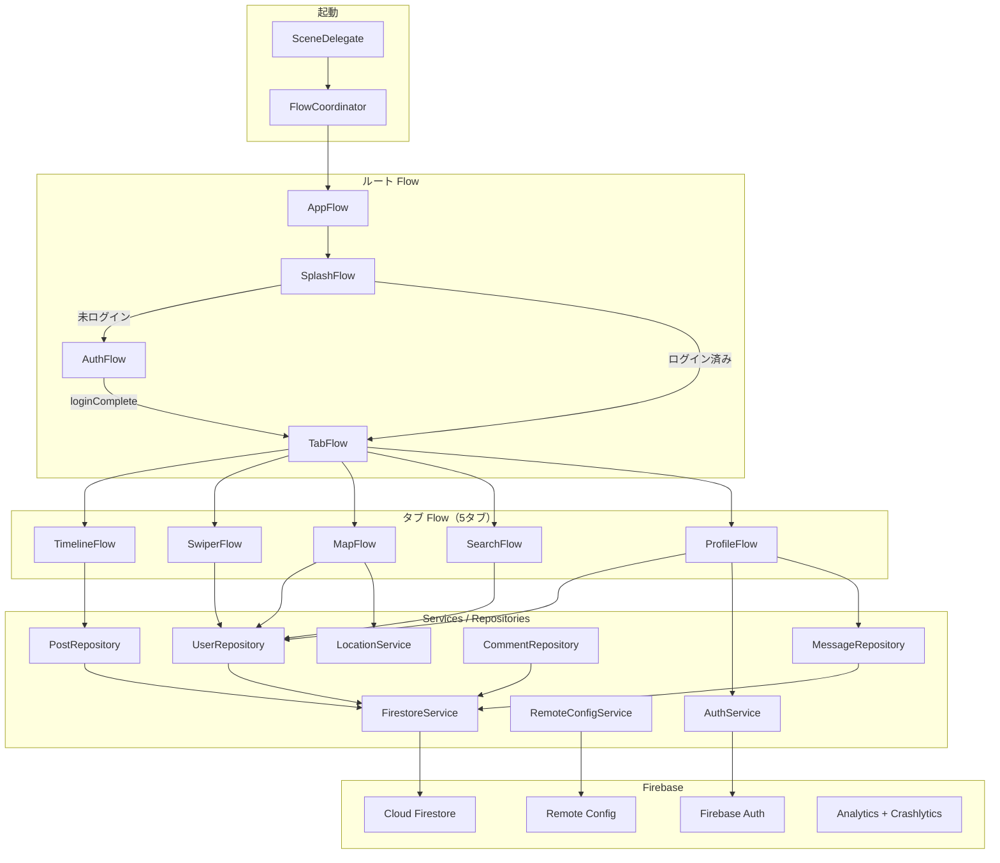
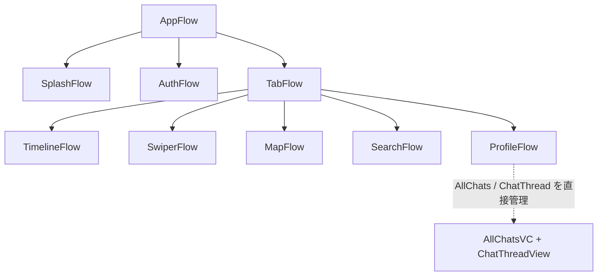
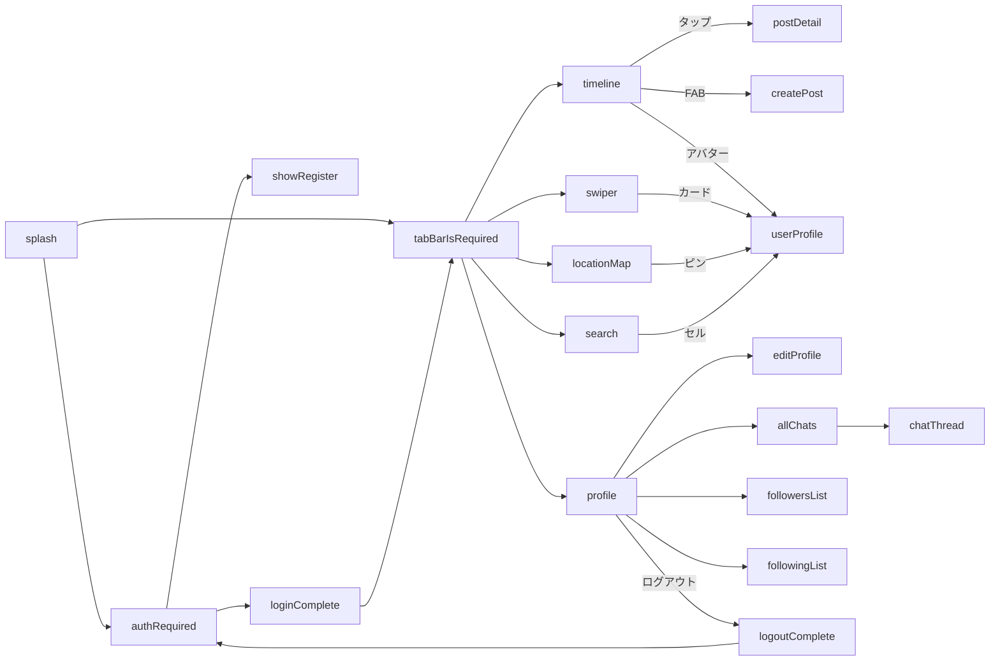
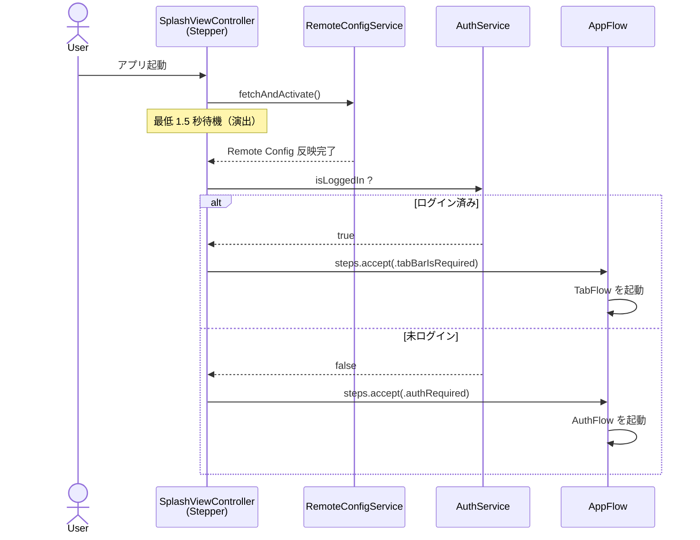
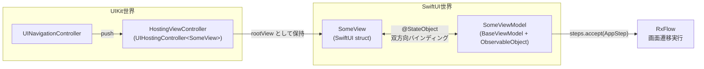

# SwiftSampleApp — LocaSocial

位置情報を使った SNS iOS アプリ「**LocaSocial**」。
Flutter 版 [`location_social_media`](https://github.com/) と同じ Firebase プロジェクト (`locationbasedinformationshare`) を共有しており、ユーザー・投稿・メッセージは同じ Firestore に書き込まれる。

UIKit (コードベース) + SwiftUI ハイブリッド構成、RxFlow による Coordinator 管理、RxSwift / Combine の二重バインディング、Firebase をバックエンドに採用。

---

## 目次

1. [主な機能](#主な機能)
2. [技術スタック](#技術スタック)
3. [セットアップ](#セットアップ)
4. [アーキテクチャ全体図](#アーキテクチャ全体図)
5. [画面遷移フロー (RxFlow)](#画面遷移フロー-rxflow)
6. [レイヤー構成](#レイヤー構成)
7. [UIKit ↔ SwiftUI ハイブリッドパターン](#uikit--swiftui-ハイブリッドパターン)
8. [デザインシステム](#デザインシステム)
9. [ディレクトリ構成](#ディレクトリ構成)
10. [ビルド方法](#ビルド方法)
11. [旧コードについて](#旧コードについて)

---

## 主な機能

| 機能 | 概要 |
|---|---|
| 認証 | Email / Password による Firebase Auth ログイン・新規登録 |
| タイムライン | 投稿一覧・新規作成・詳細・コメント・いいね（リアルタイム同期） |
| スワイパー | カード型 UI で他ユーザーを Follow / Skip |
| マップ | 自分から半径 10km 以内のユーザーを `MKMapView` 上に表示 |
| ユーザー検索 | 表示名 / メールでの prefix 検索 |
| プロフィール | 自分・他人のプロフィール表示、編集、フォロー / アンフォロー、フォロワー / フォロイング一覧 |
| チャット | 1:1 DM。会話相手一覧 + スレッド画面の双方向リアルタイム同期 |
| RemoteConfig | `time_line_view` 等のキーで機能の出し分け（Flutter 版と同一キー） |
| 計測 / 監視 | Firebase Analytics、Crashlytics |

---

## 技術スタック

### SPM で導入済み（`Package.resolved` 反映済み）

| ライブラリ | バージョン | 役割 |
|---|---|---|
| RxFlow | 2.13.2 | 画面遷移の Coordinator 管理 |
| RxSwift / RxCocoa | 6.10.1 | リアクティブストリーム |

### 手動追加が必要（[セットアップ](#セットアップ) 参照）

| ライブラリ | 用途 |
|---|---|
| FirebaseAuth | 認証 |
| FirebaseFirestore | ユーザー / 投稿 / メッセージ / コメントの永続化 |
| FirebaseAnalytics | イベント計測 |
| FirebaseRemoteConfig | 機能の出し分け |
| FirebaseCrashlytics | クラッシュ監視 |

### その他

- **SwiftUI**: Swiper / PostDetail / ChatThread の View 層
- **Combine**: `@Published` / `ObservableObject` を介した SwiftUI バインディング
- **MapKit / CoreLocation**: マップ表示と位置情報取得

---

## セットアップ

### 必要環境

- Xcode（iOS 16+ をターゲットにできるバージョン）
- iOS シミュレータ（推奨: iPhone 16）
- Firebase プロジェクト `locationbasedinformationshare` への参加権限

### 1. Firebase SDK の追加

`Package.resolved` には現状 RxFlow / RxSwift しか記録されていない。Firebase SDK は手動で追加する必要がある。

1. Xcode で `SwiftSampleApp.xcodeproj` を開く
2. **File > Add Package Dependencies...** を選択
3. URL に以下を入力:
   ```
   https://github.com/firebase/firebase-ios-sdk
   ```
4. 以下のライブラリを `SwiftSampleApp` ターゲットに追加:
   - FirebaseAuth
   - FirebaseFirestore
   - FirebaseAnalytics
   - FirebaseRemoteConfig
   - FirebaseCrashlytics

### 2. `GoogleService-Info.plist` の配置

1. [Firebase Console](https://console.firebase.google.com/) で `locationbasedinformationshare` プロジェクトを開く
2. iOS アプリの Bundle ID で `GoogleService-Info.plist` を発行 / ダウンロード
3. `SwiftSampleApp/GoogleServiceInfo/` ディレクトリ配下に配置
4. Xcode の Navigator から `SwiftSampleApp` ターゲットに追加（"Copy items if needed" にチェック）

### 3. `Info.plist` への必須キー追加

マップ機能のため、位置情報の利用許諾文言を追加する。

`SwiftSampleApp/Info.plist` に以下を追加:

```xml
<key>NSLocationWhenInUseUsageDescription</key>
<string>付近のユーザーを地図上に表示するため、現在地を使用します。</string>
```

> **注**: 現状の `Info.plist` は Scene 設定のみで、上記キーは未追加。マップ画面でクラッシュする原因になるので必ず追加すること。

---

## アーキテクチャ全体図



各 ViewModel は `BaseViewModel`（RxFlow `Stepper` 準拠）を継承しつつ、`ObservableObject` にも準拠する **二重準拠パターン**を採用している。詳細は [UIKit ↔ SwiftUI ハイブリッドパターン](#uikit--swiftui-ハイブリッドパターン) を参照。

---

## 画面遷移フロー (RxFlow)

### Flow 階層



> **メモ**: `ChatFlow.swift` はファイルとして存在するが、現状 `ProfileFlow` から参照されておらず未使用。チャット画面は `ProfileFlow` 内で直接 push される設計。

### AppStep 遷移マップ



### ログイン状態による分岐



---

## レイヤー構成

### Flows

| Flow | 役割 |
|---|---|
| `AppFlow` | ルート。Splash / Auth / Tab を切り替える |
| `SplashFlow` | スプラッシュ表示と Remote Config フェッチ、認証ルーティング |
| `AuthFlow` | Login / Register |
| `TabFlow` | 5 タブの束ね |
| `TimelineFlow` | タイムライン + 投稿詳細 + 新規投稿 |
| `SwiperFlow` | カードスワイプ |
| `MapFlow` | 位置情報マップ |
| `SearchFlow` | ユーザー検索 |
| `ProfileFlow` | 自分のプロフィール + 編集 + フォロー一覧 + チャット |

### Features

各 Feature は `ViewController` + `ViewModel` の組で構成され、必要に応じて SwiftUI View / Hosting を加える。

| Feature | 主な構成 | 実装形式 |
|---|---|---|
| `Splash` | SplashViewController | UIKit |
| `Auth` | LoginVC + RegisterVC + 各 VM + AuthTextField | UIKit |
| `Timeline` | TimelineVC + TimelineVM、CreatePostVC + VM | UIKit (UITableView) |
| `Swiper` | SwiperHostingViewController + SwiperView + SwiperVM | **SwiftUI Hosting** |
| `Map` | MapViewController + MapVM + UserAnnotation | UIKit (MKMapView) |
| `Search` | SearchVC + SearchVM + UserSearchCell | UIKit (UISearchController) |
| `Profile` | ProfileVC + VM、EditProfileVC + VM、AvatarImageView | UIKit |
| `PostDetail` | PostDetailHostingViewController + PostDetailView + VM | **SwiftUI Hosting** |
| `UserProfile` | UserProfileVC + VM | UIKit |
| `FollowList` | FollowListVC + VM（`Mode` enum で followers/following を切替） | UIKit (UITableView) |
| `Chat` | AllChatsVC + VM (UIKit) + ChatThreadHostingViewController + ChatThreadView + VM | **混在** |

### Services / Repositories

すべて `Singleton` で公開され、RxSwift `Single` / `Observable` を返す。

| クラス | 主要 API |
|---|---|
| `AuthService` | `signIn / register / signOut`、`currentUser: Observable<User?>`、`isLoggedIn` |
| `FirestoreService` | 汎用 CRUD: `setDocument / fetchDocument / fetchCollection / listenToDocument / listenToCollection` |
| `UserRepository` | `createUser / fetchUser / updateUser / updateLocation / searchUsers / follow / unfollow / fetchFollowers / fetchFollowing` |
| `PostRepository` | `fetchTimeline (Observable, limit 50)`、`fetchPostsByUser`、`createPost`、`deletePost`、`likePost / unlikePost` |
| `MessageRepository` | `fetchMessages (双方向マージ)`、`fetchConversationPartners`、`sendMessage`、`markAsRead` |
| `CommentRepository` | `posts/{id}/comments` サブコレクションの監視・追加・削除 |
| `RemoteConfigService` | `fetchAndActivate`、`timelineViewEnabled`、`swiperEnabled`、`maxPostLength`、`minimumAppVersion` |
| `LocationService` | `currentLocation: Observable<CLLocation>`、`requestPermission`、`stopUpdating`（100m 精度） |

### Models

すべて `Codable + Equatable + Identifiable` 準拠。

| Model | 主なフィールド |
|---|---|
| `UserModel` | `uid`, `email`, `displayName`, `photoUrl`, `followers[]`, `following[]`, `latitude?`, `longitude?` |
| `UserPost` | `postId`, `userId`, `username`, `message`, `timestamp`, `likes[]` |
| `Message` | `messageId`, `senderId`, `senderEmail`, `receiverId`, `message`, `timestamp`, `isRead` |
| `Comment` | `commentId`, `postId`, `userId`, `username`, `text`, `timestamp` |

### Components

| Component | 説明 |
|---|---|
| `AvatarImageView` (UIKit) | 40pt 円形アバター。photoUrl があれば画像表示、なければ initials を描画 |
| `AvatarView` (SwiftUI) | `AsyncImage` ベース、フォールバックで initials |
| `SNSCardView` (UIKit) | Surface 色 + 角丸 16pt + カード影。Dark Mode 切替に追従 |
| `PrimaryButton` (UIKit) | プライマリ色 / 高さ 52pt / タップ時のスケール&アルファアニメーション |

### DesignSystem

- `AppTheme`: Primary / Secondary / Background / Surface / TextPrimary などのカラートークン、Spacing / CornerRadius / Shadow
- `AppTabBarAppearance`: タブバーの統一 appearance
- `UIColor+Hex`: 16進カラーコードを `UIColor` に変換するユーティリティ。SwiftUI 向け Color 拡張も提供

詳細は [デザインシステム](#デザインシステム) セクション参照。

---

## UIKit ↔ SwiftUI ハイブリッドパターン

SwiftUI 画面を UIKit の `UINavigationController` に push するため、`UIHostingController` をラッパー（玄関口）として挟む。本プロジェクトでは `Swiper` / `PostDetail` / `ChatThread` の 3 画面で採用。



### `BaseViewModel` + `ObservableObject` 二重準拠

タブ切り替えで View が再生成されても ViewModel の状態を保持できるよう、また RxFlow の `Stepper` としても機能できるよう、ViewModel は次の 2 つに同時準拠する:

- `BaseViewModel` (= RxFlow `Stepper`) — `steps: PublishRelay<Step>` を介して遷移を発火
- `ObservableObject` (Combine) — `@Published` プロパティで SwiftUI を再描画

### `@StateObject` vs `@ObservedObject`

`UIHostingController` 経由で SwiftUI View を使う場合、`@ObservedObject` だと UIKit のライフサイクルとズレてデータが表示されないことがある。`@StateObject` を使うことで View が ViewModel を所有し、安定して描画される。

| | `@ObservedObject` | `@StateObject` |
|---|---|---|
| オブジェクトの所有 | しない（外部が保持） | View が所有 |
| `UIHostingController` との相性 | ❌ 再描画が不安定になる場合あり | ✅ 安定 |
| 外から DI する方法 | `var viewModel: VM` で受け取る | `_viewModel = StateObject(wrappedValue: vm)` |

```swift
// UIHostingController 配下で使う際の正しいパターン
struct SwiperView: View {
    @StateObject private var viewModel: SwiperViewModel

    init(viewModel: SwiperViewModel) {
        _viewModel = StateObject(wrappedValue: viewModel)
    }
}
```

### Flutter (Riverpod) との対比

| Swift | Flutter (Riverpod) |
|---|---|
| `@StateObject` | `StateNotifierProvider`（Provider が所有） |
| `@ObservedObject` | `ref.watch` で外部参照するだけ |
| `@Published` | `state` の変更通知 |
| `ObservableObject` | `StateNotifier` / `AsyncNotifier` |
| `BaseViewModel` (Stepper) | `GoRouter` の `redirect` を発火する Notifier |

---

## デザインシステム

### カラートークン

| Token | Light | Dark |
|---|---|---|
| Primary | `#01896C` | `#37B6E9` |
| Secondary | `#F45479` | `#8BF8C4` |
| Background | `#F2F2F7` | `#192734` |
| Surface (カード) | `#FFFFFF` | `#22303C` |
| TextPrimary | `#1C1C1E` | `#FFFFFF` |

### その他のトークン

`AppTheme` には以下も定義済み:
- **Spacing**: 4 / 8 / 12 / 16 / 24 / 32
- **CornerRadius**: 8 / 12 / 16
- **Shadow**: カード用の影プリセット

### 使い方

UIKit:
```swift
view.backgroundColor = AppTheme.background
label.textColor = AppTheme.textPrimary
```

SwiftUI:
```swift
Text("Hello")
    .foregroundStyle(Color.appTextPrimary)
    .background(Color.appSurface)
```

---

## ディレクトリ構成

```
SwiftSampleApp/
├── AppDelegate.swift
├── SceneDelegate.swift
├── Info.plist
├── DesignSystem/             # AppTheme / AppTabBarAppearance / UIColor+Hex
├── Models/                   # UserModel / UserPost / Message / Comment
├── Services/                 # AuthService / FirestoreService / 各 Repository / RemoteConfigService / LocationService
├── Components/               # AvatarImageView / AvatarView / SNSCardView / PrimaryButton
├── Common/                   # BaseViewModel
├── Configs/                  # （将来拡張用、現状空）
├── Data/                     # （将来拡張用、現状空）
├── Protocols/                # （将来拡張用、現状空）
├── Utility/                  # （将来拡張用、現状空）
├── Resources/                # icons.riv (Rive アニメーション)
├── GoogleServiceInfo/        # GoogleService-Info.plist 配置先
├── Flows/
│   ├── AppStep.swift                  # 全 Step 定義 enum
│   ├── AppFlow.swift
│   ├── SplashFlow.swift
│   ├── AuthFlow.swift
│   ├── TabFlow.swift
│   ├── TimelineFlow.swift
│   ├── SwiperFlow.swift
│   ├── MapFlow.swift
│   ├── SearchFlow.swift
│   ├── ProfileFlow.swift
│   ├── ChatFlow.swift                 # 現状未参照（ProfileFlow が直接管理）
│   └── (Legacy) HomeFlow / BrowsingFlow / FavoriteFlow / MyPageFlow / ReservationFlow
└── Features/
    ├── Splash/                        # SplashViewController
    ├── Auth/                          # Login / Register
    ├── Timeline/                      # 一覧 + CreatePost
    ├── Swiper/                        # SwiftUI Hosting
    ├── Map/                           # MKMapView
    ├── Search/                        # UISearchController
    ├── Profile/                       # 自分のプロフィール + 編集
    ├── PostDetail/                    # SwiftUI Hosting (詳細 + コメント)
    ├── UserProfile/                   # 他ユーザー
    ├── FollowList/                    # フォロワー / フォロイング
    ├── Chat/                          # AllChats (UIKit) + ChatThread (SwiftUI Hosting)
    └── (Legacy) HomePage / BrowsingHistory / Favorite / MyPage / Reservation /
                  RootTabBar / RootTabBarViewController.swift / RootViewController.swift
```

---

## ビルド方法

```bash
# Xcode でプロジェクトを開く
open SwiftSampleApp.xcodeproj

# コマンドラインからビルド
xcodebuild -scheme SwiftSampleApp -destination 'platform=iOS Simulator,name=iPhone 16'

# テスト実行
xcodebuild test -scheme SwiftSampleApp -destination 'platform=iOS Simulator,name=iPhone 16'
```

> Firebase SDK 未追加状態ではコンパイルが通らない。先に [セットアップ](#セットアップ) を完了させること。

---

## 旧コードについて

このプロジェクトは元々「美容サロン向けサンプル」として実装されていたものを LocaSocial に作り変えた経緯があり、旧構成のファイルが一部残置している。`.pbxproj` の手動編集を避けるためファイルシステム上は残っているが、参照されていない。

### 残置している旧 Flow（空実装）

- `Flows/HomeFlow.swift` → `TimelineFlow` に置換済み
- `Flows/BrowsingFlow.swift` → `SearchFlow` に置換済み
- `Flows/FavoriteFlow.swift` → `MapFlow` に置換済み
- `Flows/MyPageFlow.swift` → `ProfileFlow` に置換済み
- `Flows/ReservationFlow.swift` → `SwiperFlow` に置換済み

### 残置している旧 Features

- `Features/HomePage/`
- `Features/BrowsingHistory/`
- `Features/Favorite/`
- `Features/MyPage/`
- `Features/Reservation/`
- `Features/RootTabBar/`、`Features/RootTabBarViewController.swift`、`Features/RootViewController.swift`

削除する場合は Xcode Navigator から手動でターゲットを外せばビルドエラーにはならない。
