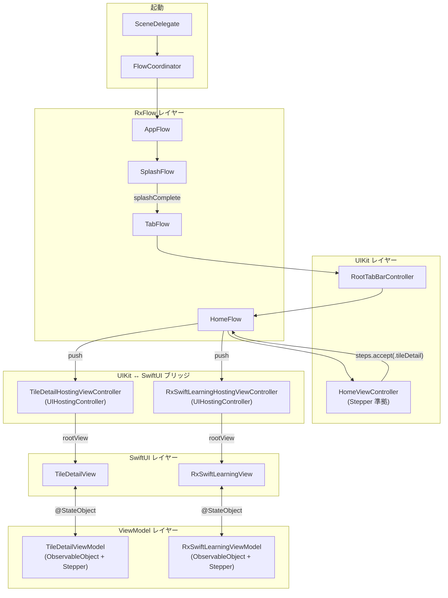
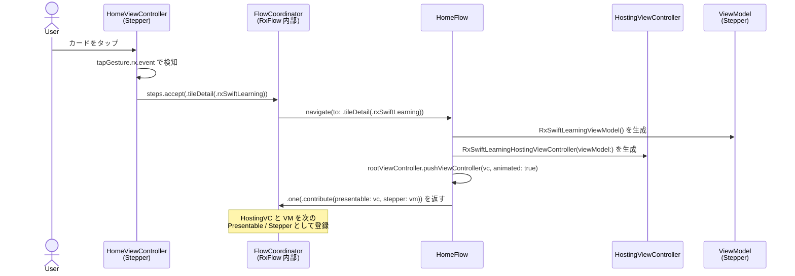
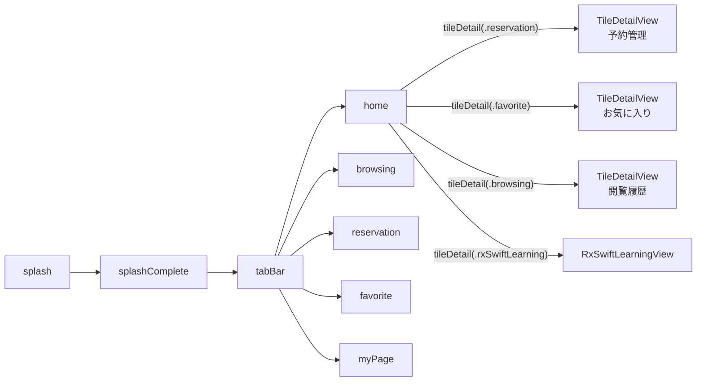
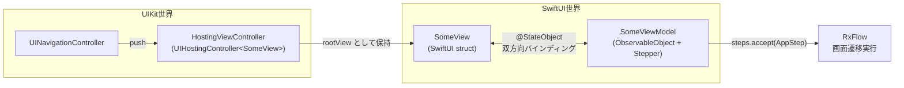
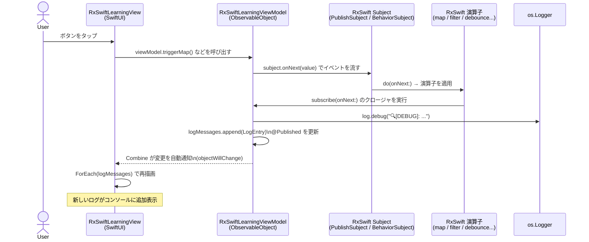
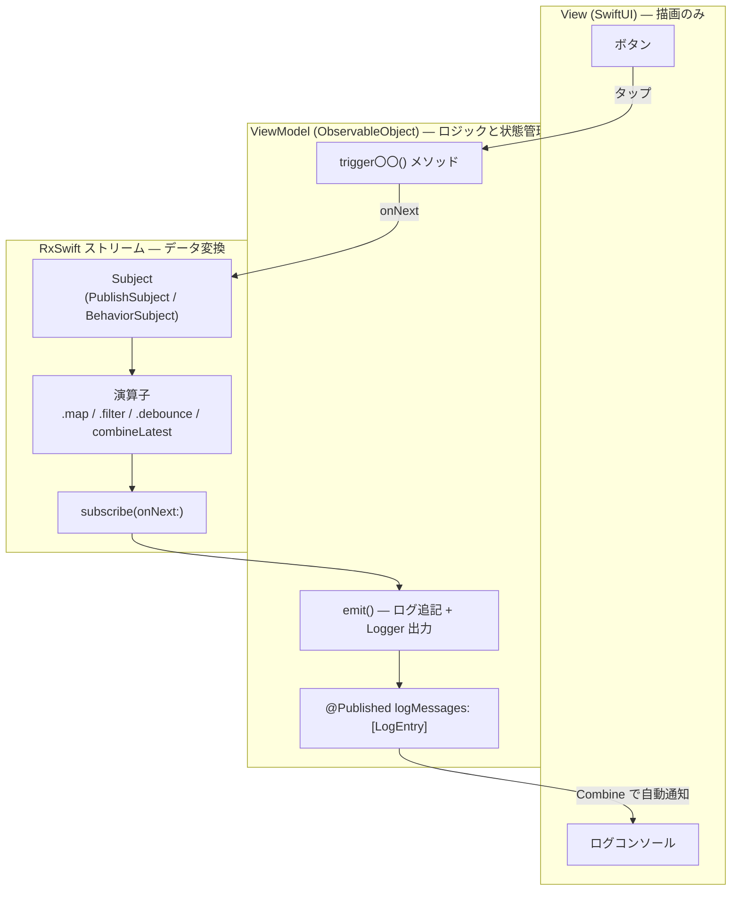
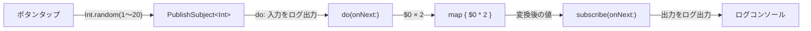
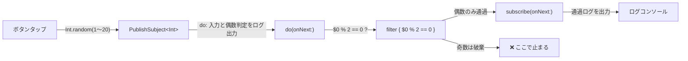
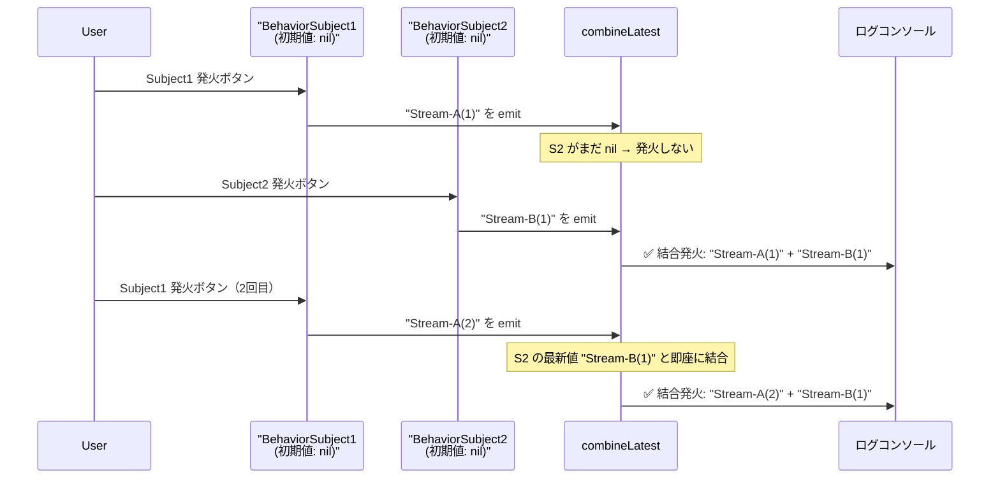

# SwiftSampleApp

美容サロン向けサンプル iOS アプリ。
UIKit (コードベース) + SwiftUI + RxFlow + RxSwift の組み合わせで構築されている。

---

## 目次

1. [技術スタック](#技術スタック)
2. [アーキテクチャ全体図](#アーキテクチャ全体図)
3. [画面遷移フロー (RxFlow)](#画面遷移フロー-rxflow)
4. [UIKit ↔ SwiftUI ブリッジパターン](#uikit--swiftui-ブリッジパターン)
5. [RxSwift データ表示の仕組み](#rxswift-データ表示の仕組み)
6. [演算子ごとのデータフロー](#演算子ごとのデータフロー)
7. [ディレクトリ構成](#ディレクトリ構成)
8. [ビルド方法](#ビルド方法)

---

## 技術スタック

| ライブラリ | バージョン | 役割 |
|---|---|---|
| RxFlow | 2.13.2 | 画面遷移の Coordinator 管理 |
| RxSwift / RxCocoa | 6.10.1 | リアクティブプログラミング |
| SwiftUI | — | 詳細画面の UI 構築 |
| UIKit | — | タブバー・ホーム画面の UI 構築 |
| Combine | — | ObservableObject / @Published によるバインディング |

パッケージ管理は **Swift Package Manager (SPM)** を使用。

---

## アーキテクチャ全体図



---

## 画面遷移フロー (RxFlow)

ユーザー操作から画面が push されるまでのシーケンス。



### AppStep の全遷移一覧



---

## UIKit ↔ SwiftUI ブリッジパターン

SwiftUI 画面を UIKit の NavigationController に push するために
`UIHostingController` をラッパー (玄関口) として使う。



### `@ObservedObject` vs `@StateObject`

`UIHostingController` 経由で SwiftUI View を使う場合、`@ObservedObject` では UIKit のライフサイクルとズレてデータが表示されないことがある。`@StateObject` を使うことで View が ViewModel を所有し、安定して描画される。

| | `@ObservedObject` | `@StateObject` |
|---|---|---|
| オブジェクトの所有 | しない（外部が保持） | View が所有 |
| UIHostingController との相性 | ❌ 再描画が不安定になる場合あり | ✅ 安定 |
| 外から DI する方法 | `var viewModel: VM` で受け取る | `_viewModel = StateObject(wrappedValue: vm)` |

```swift
// 正しいパターン（UIHostingController 使用時）
struct SomeView: View {
    @StateObject private var viewModel: SomeViewModel

    init(viewModel: SomeViewModel) {
        _viewModel = StateObject(wrappedValue: viewModel)
    }
}
```

Flutter の Riverpod との対比:

| Swift | Flutter (Riverpod) |
|---|---|
| `@StateObject` | `StateNotifierProvider`（Provider が所有） |
| `@ObservedObject` | `ref.watch` で外部参照するだけ |
| `@Published` | `state` の変更通知 |
| `ObservableObject` | `StateNotifier` / `AsyncNotifier` |

---

## RxSwift データ表示の仕組み

ボタン押下からログがコンソールに表示されるまでの全体フロー。



### レイヤー別の責務



---

## 演算子ごとのデータフロー

### map — 値を変換する

入力値を別の値に変換して流す。本アプリではランダムな整数を × 2 にする。



**ログ出力例:**
```
── map ───────────────────────
🔍[DEBUG]: [map] 入力: 7
🔍[DEBUG]: [map] 出力: 14  (7 × 2)
```

---

### filter — 条件でフィルタリング

条件を満たす要素のみを下流に流す。本アプリでは偶数のみ通過させる。



**ログ出力例（偶数の場合）:**
```
── filter ────────────────────
🔍[DEBUG]: [filter] 入力: 8  偶数? → ✅ 通過
🔍[DEBUG]: [filter] ↳ ダウンストリームへ: 8
```

**ログ出力例（奇数の場合）:**
```
── filter ────────────────────
🔍[DEBUG]: [filter] 入力: 5  偶数? → ❌ 除外
```

---

### combineLatest — 複数ストリームを結合

**2つのストリームが両方とも値を持ったとき**に結合して発火する。
どちらか片方だけでは発火しない点がポイント。



**ログ出力例:**
```
🔍[DEBUG]: [combineLatest] Subject1 ← "Stream-A(1)"
  （S2 がまだ nil のため発火しない）

🔍[DEBUG]: [combineLatest] Subject2 ← "Stream-B(1)"
🔍[DEBUG]: [combineLatest] ✅ 結合発火: "Stream-A(1)" + "Stream-B(1)"
```

---

### debounce — 連続イベントを間引く

指定した時間 (300ms) 以内に連続してイベントが来ても、最後の 1 つだけ下流に流す。
検索ボックスの入力補完や連打防止によく使われる。

```mermaid
sequenceDiagram
    participant U as "User（連打）"
    participant SBJ as "PublishSubject&lt;Int&gt;"
    participant DBC as "debounce<br/>(300ms, MainScheduler)"
    participant SUB as subscribe
    participant LOG as ログコンソール

    U->>SBJ: タップ #1
    SBJ->>DBC: 1 を emit
    DBC->>LOG: 🔍[DEBUG]: 受信 #1 (300ms 待機中...)
    Note over DBC: タイマーリセット

    U->>SBJ: タップ #2（100ms 後）
    SBJ->>DBC: 2 を emit
    DBC->>LOG: 🔍[DEBUG]: 受信 #2 (300ms 待機中...)
    Note over DBC: タイマーリセット

    U->>SBJ: タップ #3（100ms 後）
    SBJ->>DBC: 3 を emit
    DBC->>LOG: 🔍[DEBUG]: 受信 #3 (300ms 待機中...)
    Note over DBC: 300ms 経過（連打なし）

    DBC->>SUB: 3 だけ emit（最後の値のみ下流へ）
    SUB->>LOG: 🔍[DEBUG]: ✅ 発火! 最終タップ: #3
```

**ログ出力例（3 連打した場合）:**
```
── debounce ──────────────────
🔍[DEBUG]: [debounce] 受信 #1  (300ms 待機中...)
── debounce ──────────────────
🔍[DEBUG]: [debounce] 受信 #2  (300ms 待機中...)
── debounce ──────────────────
🔍[DEBUG]: [debounce] 受信 #3  (300ms 待機中...)
🔍[DEBUG]: [debounce] ✅ 発火! 最終タップ: #3
```

---

## ディレクトリ構成

```
SwiftSampleApp/
├── Flows/
│   ├── AppStep.swift                             # 全遷移ステップの enum
│   ├── AppFlow.swift
│   ├── SplashFlow.swift
│   ├── TabFlow.swift
│   ├── HomeFlow.swift                            # タイル詳細・RxSwift学習への遷移を管理
│   ├── BrowsingFlow.swift
│   ├── FavoriteFlow.swift
│   ├── MyPageFlow.swift
│   └── ReservationFlow.swift
├── Features/
│   ├── Splash/
│   │   └── SplashViewController.swift
│   ├── RootTabBar/Home/
│   │   └── HomeViewController.swift             # タイルタップで steps を発火
│   ├── HomePage/
│   │   ├── HomeTileItem.swift                   # タイル種別 enum
│   │   ├── TileDetailViewModel.swift            # 汎用タイル詳細 ViewModel
│   │   ├── TileDetailView.swift                 # 汎用タイル詳細 View (SwiftUI)
│   │   ├── TileDetailHostingViewController.swift
│   │   ├── RxSwiftLearningViewModel.swift       # 演算子デモ ViewModel
│   │   ├── RxSwiftLearningView.swift            # 演算子ボタン + ログコンソール (SwiftUI)
│   │   └── RxSwiftLearningHostingViewController.swift
│   ├── BrowsingHistory/
│   ├── Favorite/
│   ├── MyPage/
│   └── Reservation/
└── Components/
    └── CardView.swift                           # ホーム画面のタイルカード (UIKit)
```

---

## ビルド方法

```bash
# Xcode でプロジェクトを開く
open SwiftSampleApp.xcodeproj

# コマンドラインからビルド
xcodebuild -scheme SwiftSampleApp -destination 'platform=iOS Simulator,name=iPhone 16'

# テスト実行
xcodebuild test -scheme SwiftSampleApp -destination 'platform=iOS Simulator,name=iPhone 16'
```
