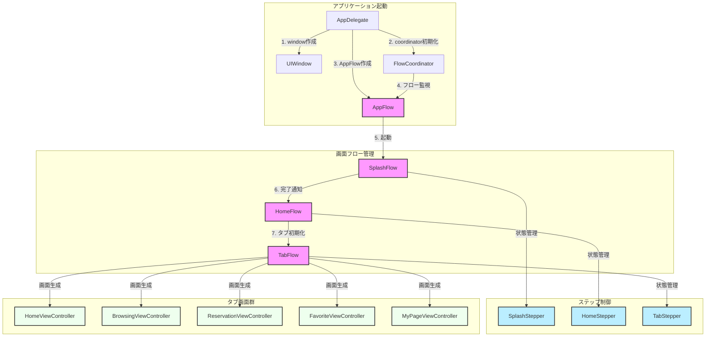

# SwiftSampleApp - コードベース + RxFlow実装

このプロジェクトは iOS アプリケーションをコードベースで実装し、画面遷移を RxFlow で管理する実装例です。

## アーキテクチャの特徴

1. **コードベースUI**
   - Storyboardを使用せず、UIをコードで構築
   - より柔軟なUI実装と保守性の向上
   - マージコンフリクトのリスク低減
   - ユニットテストの容易性

2. **RxFlowによる画面遷移管理**
   - 宣言的なフロー定義
   - 画面遷移ロジックの集中管理
   - 依存性注入のサポート
   - 高いテスト可能性

## アプリケーション遷移フロー



## 実装の詳細

### 1. プロジェクト設定

Info.plist:

```xml
<key>UIMainStoryboardFile</key>
<string>LaunchScreen</string>
```

### 2. アプリケーション初期化

AppDelegate.swift:

```swift
@UIApplicationMain
class AppDelegate: UIResponder, UIApplicationDelegate {
    var window: UIWindow?
    var coordinator: FlowCoordinator?
    var appFlow: AppFlow?
    
    func application(_ application: UIApplication, 
                    didFinishLaunchingWithOptions launchOptions: [UIApplication.LaunchOptionsKey: Any]?) -> Bool {
        setupWindow()
        setupFlow()
        return true
    }
    
    private func setupWindow() {
        window = UIWindow(frame: UIScreen.main.bounds)
        window?.backgroundColor = .white
        window?.makeKeyAndVisible()
    }
    
    private func setupFlow() {
        let coordinator = FlowCoordinator()
        let appFlow = AppFlow()
        
        coordinator.coordinate(flow: appFlow, with: AppStepper())
        
        self.coordinator = coordinator
        self.appFlow = appFlow
        
        Flows.use(appFlow, when: .created) { root in
            self.window?.rootViewController = root
        }
    }
}
```

### 3. フロー定義

AppFlow.swift:

```swift
final class AppFlow: Flow {
    var root: Presentable {
        return self.rootViewController
    }
    
    private lazy var rootViewController = UINavigationController()
    
    func navigate(to step: Step) -> FlowContributors {
        guard let step = step as? AppStep else { return .none }
        
        switch step {
        case .splash:
            return navigateToSplash()
        case .tabBar:
            return navigateToTabBar()
        }
    }
    
    private func navigateToSplash() -> FlowContributors {
        let splashFlow = SplashFlow()
        
        Flows.use(splashFlow, when: .created) { [unowned self] root in
            self.rootViewController.pushViewController(root, animated: false)
        }
        
        return .one(flowContributor: .contribute(
            withNextPresentable: splashFlow,
            withNextStepper: OneStepper(withSingleStep: AppStep.splash)
        ))
    }
    
    private func navigateToTabBar() -> FlowContributors {
        let tabFlow = TabFlow()
        
        Flows.use(tabFlow, when: .created) { [unowned self] root in
            self.rootViewController.setViewControllers([root], animated: false)
        }
        
        return .one(flowContributor: .contribute(
            withNextPresentable: tabFlow,
            withNextStepper: OneStepper(withSingleStep: AppStep.tabBar)
        ))
    }
}
```

### 4. 画面実装例

HomeViewController.swift:

```swift
final class HomeViewController: UIViewController {
    private let titleLabel: UILabel = {
        let label = UILabel()
        label.text = "ホーム"
        label.textAlignment = .center
        return label
    }()
    
    override func viewDidLoad() {
        super.viewDidLoad()
        setupUI()
    }
    
    private func setupUI() {
        view.backgroundColor = .white
        
        view.addSubview(titleLabel)
        titleLabel.translatesAutoresizingMaskIntoConstraints = false
        
        NSLayoutConstraint.activate([
            titleLabel.centerXAnchor.constraint(equalTo: view.centerXAnchor),
            titleLabel.centerYAnchor.constraint(equalTo: view.centerYAnchor)
        ])
    }
}
```

## プロジェクト構成

```tree
SwiftSampleApp/
├── AppDelegate.swift
├── Features/
│   ├── App/
│   │   ├── AppFlow.swift
│   │   └── AppStep.swift
│   ├── Splash/
│   │   ├── SplashFlow.swift
│   │   └── SplashViewController.swift
│   ├── Home/
│   │   ├── HomeFlow.swift
│   │   └── HomeViewController.swift
│   └── TabBar/
│       ├── TabFlow.swift
│       └── TabBarController.swift
└── Resources/
    └── LaunchScreen.storyboard
```

## セットアップ手順

1. 依存パッケージのインストール:

```bash
pod init
```

Podfile の内容:

```ruby
pod 'RxFlow'
pod 'RxSwift'
pod 'RxCocoa'
```

パッケージのインストール:

```bash
pod install
```

1. プロジェクトを開く:

```bash
open SwiftSampleApp.xcworkspace
```

## テスト

フローのテスト例:

```swift
class AppFlowTests: XCTestCase {
    var coordinator: FlowCoordinator!
    var appFlow: AppFlow!
    
    override func setUp() {
        super.setUp()
        coordinator = FlowCoordinator()
        appFlow = AppFlow()
    }
    
    func testNavigationToSplash() {
        // Given
        let step = AppStep.splash
        
        // When
        let result = appFlow.navigate(to: step)
        
        // Then
        guard case .one(let flowContributor) = result else {
            XCTFail("Expected one contributor")
            return
        }
        
        XCTAssertTrue(flowContributor.nextPresentable is SplashFlow)
    }
}
```

## 改善点と注意事項

1. **メモリ管理**
   - Flowでの循環参照に注意（`[unowned self]`や`[weak self]`の適切な使用）
   - ViewControllerの解放タイミングの確認

2. **テスト容易性**
   - 各Flowは独立してテスト可能
   - Stepperのテストで画面遷移ロジックを検証

3. **今後の改善案**
   - DIコンテナの導入
   - 画面遷移のアニメーション管理の共通化
   - エラーハンドリングの強化

## 実装手順

### 1. プロジェクトの初期化

```bash
open Swift SampleApp.xcworkspace
```

### 2. CocoaPodsのセットアップ

```bash
pod init
pod install
```

### 3. 画面フローの実装

- AppFlow: アプリケーションのメインフロー
- SplashFlow: スプラッシュ画面フロー
- HomeFlow: ホーム画面フロー
- TabFlow: タブバーフロー

### 4. 各画面の実装

- SplashViewController: 起動時のスプラッシュ画面
- HomeViewController: ホーム画面
- BrowsingViewController: 閲覧履歴画面
- ReservationViewController: 予約画面
- FavoriteViewController: お気に入り画面
- MyPageViewController: マイページ画面

## 実装時の注意点

1. **フロー設計**
   - 各フローは独立して管理可能な単位で分割
   - Stepperを使用して画面遷移の状態を管理
   - フロー間の依存関係を最小限に抑える

2. **依存性注入**
   - サービスやモデルの注入はフロー内で実施
   - ViewControllerは必要な依存のみを受け取る設計
   - テスト時のモック差し替えを考慮

3. **メモリ管理**
   - フロー間の循環参照に注意
   - 適切なタイミングでのリソース解放
   - 子フローの適切な終了処理

4. **エラーハンドリング**
   - フロー内でのエラー状態の適切な処理
   - ユーザーへの適切なフィードバック表示
   - エラー発生時の代替フローの提供

## ビルドと実行

1. ビルド前の確認:
   - 依存パッケージが正しくインストールされているか
   - Info.plistの設定が正しいか
   - 必要なリソースファイルが含まれているか

2. ビルドと実行:
   - Xcodeでプロジェクトを開く
   - ターゲットデバイス/シミュレータを選択
   - ビルドして実行 (⌘R)

3. 動作確認:
   - スプラッシュ画面の表示
   - タブバーの初期化と表示
   - 各画面への遷移
   - メモリリークの確認
